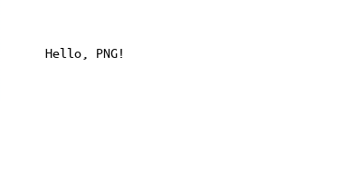

# Pepetected
---


## Introduction
Are you tired of hiding your top-secret messages in plain sight, only to have them discovered by prying eyes? Say goodbye to the age-old methods of discreetly passing notes or encrypting your texts with boring codes. It's time to embrace the future of covert communication with the Pepetected app!

Imagine a world where your confidential messages are hidden within the hilarious world of Pepes. Welcome to Pepetected, the app that turns your everyday conversations into a comedy show and a cryptic puzzle all in one!

With Pepetected, you can take your secret messages and wrap them up in a meme so funny that even if someone stumbles upon your chat, they'll be too busy laughing to decode your hidden gems. It's like having your own personal inside joke that's also a covert operation.

## Demo
Do you think these 2 images are the same?

Pepe             |  Still Pepe
:-------------------------:|:-------------------------:
 |  

In fact, the right one is embedding "Welcome to pepetected!" but it is only revealed if you **enter the correct password**!

We also provide a simpler version, in case you only want to hide by text only.


## Installation
You should create an [Python virtual environment](https://docs.python.org/3/library/venv.html)

Then run the following script
```
python3 -m venv venv
source venv/bin/activate
pip install -r requirements.txt
```

